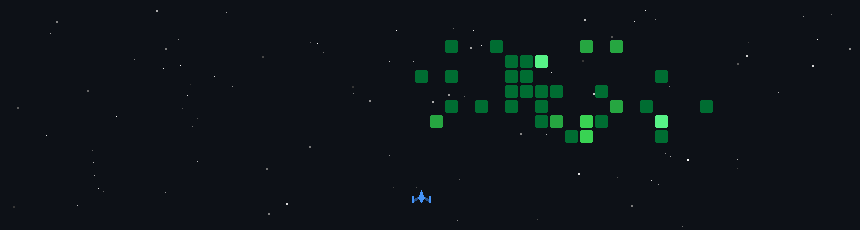

What's up there, Welcome to my GitHub!, I'm Lùi ( Roasted Sweet Potato 🍠 ), 
I'm on a journey of learning and developing my coding skills, one line at a time.
---
📫 Connect Me : gmail: nguyenkykhoi2603@gmail.com
---

<!--
**NguyenKyKhoi/NguyenKyKhoi** is a ✨ _special_ ✨ repository because its `README.md` (this file) appears on your GitHub profile.

Here are some ideas to get you started:

- 🔭 I’m currently working on ...
- 🌱 I’m currently learning ...
- 👯 I’m looking to collaborate on ...
- 🤔 I’m looking for help with ...
- 💬 Ask me about ...
- 📫 How to reach me: ...
- 😄 Pronouns: ...
- ⚡ Fun fact: ...
-->
